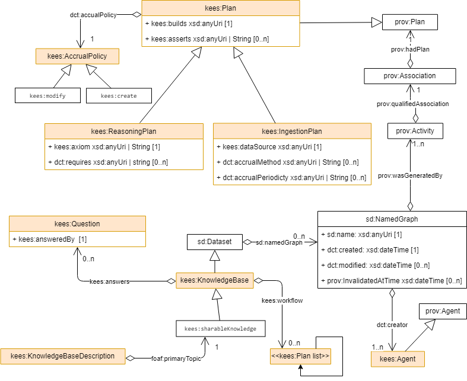

KEES: Knowledge Exchange Engine Service 
=======================================

**WARNING: WORKING IN PROGRESS**

In order to let computers to work for us, they must understand data: 
not just the grammar and the syntax but the real meaning of things. 

KEES proposes some specifications to add metadata to a *domain knowledge* in order to make it tradeable and shareable. 

KEES allows to formalize and license:

- how to collect the right data, 
- how much you can trust in your data, 
- what new information you can deduct from the collected data,
- how to answer to specific questions using data

Artificial intelligences and humans can use these *know hows* to reuse and enrich existing knowledge. KEES is a Semantic Web Application.

See [KEES presentation slides](https://docs.google.com/presentation/d/1mv9XO0Q9QFxSphWzT_68Q4aXd9sgqWoY7njomH8eaPQ/pub?start=false&loop=false&delayms=5000)

## Core KEES concepts

Lot of concepts used by KEES refer to the well known [Semantic Web Standards](https://www.w3.org/standards/semanticweb/) published by the World Wide Web Consortium ([W3C](https://w3.org/)).

What is **data**? According with common sense, KEES defines data as words, numbers or in general *any string of symbols*.  This concept is equivalent to the definition of "literal" in the [RDF] (Resource Data Framework). Example of data is the string  `xyz`, the numbers `123`, `33.22` or the URI `http://LinkedData.Center`. Note that the data is usually associated with a  _data type_ it is just a name that states a set of restrictions on symbols string that build up the data;  _data type_ is not the data meaning.

What is **information**? KEES defines information as *data with a meaning*. The meaning can be 
learned from the context where a data is found or explicitly defined. From a practical point of view, because KEES adopts the [RDF standards](https://www.w3.org/RDF/), an information is defined by three data that build up a _triple_ (also known as a RDF statement): a _subject_, a _predicate_ and an _object_. The data type for the first two triple elements (subject and predicate) must be an URIs, the last element of the triple (object) can be anything. A triple can be also rapresented as an [unidirected labeled graph]( :

KEES defines **knowledge** as a graph of linked information (i.e. linked data). This graph is possible because, in RDF, any URI can be both the object of a triple  and the subject of another one or even a predicate for another.

KEES defines **knowledge base** (or **knowledge graph** ) as a container of *linked data with a purpose*, that is a related set information that can be composed to provide answer to some questions. 

From a theoretical point of view, a KEES knowledge base is composed by information (i.e. fatcs), plus a formal system of logic used for knowledge representation, plus the [Open-world assumption](https://en.wikipedia.org/w/index.php?title=Open-world_assumption&oldid=871019791).

The information are partitioned in two set: *TBox* and *ABox*. *ABox statements* describe facts,  *TBox statements* describe the terms used to qualify the facts meaning. If you are familiar with object-oriented paradigm, TBox statements sometimes associate with classes, while ABox associate with individual class instances. 
*TBox statements* tend to be more permanent within a knowledge base and are often grouped in *ontologies* that describe a specific 
knowledge domain (e.g. business entities, people, goods, friendship, offering, geocoding, etc, etc).
*ABox statements* associate with instances of classes defined by TBox statements. ABox statements are much more dynamic in nature and 
are populated from datasets available in the web or by reasonings. 

For practical purposes, KEES knowledge base fully conforms to the [Semantic Web Standards](https://www.w3.org/standards/semanticweb/) and assumes that the knowledge base can be defined in a [SPARQL service](https://www.w3.org/TR/sparql11-service-description).

The **Question** represents the reason for the the knowledge base existence. In other words, the knoledge base exists to answer to *questions*. Question are natural language expressions that can be expressed as parametric SPARQL queries on a populated knowledge graph. The answer to a question can be a table of data, a structured document, a boolean or a translation of these in a natural language sentences.

**Trust** is another key concept in KEES. The [Open-world assumption] and RDF allow to mix any kind of information, even when information that are incoerent. For instance, suppose that your TBOX defines a property "person:hasMom" that require a cardinality of 1 (i.e. every person has just one "mom"), your knowledge base could contains two different fact (:jack person:hasMom :Mary) and (:jack person:hasMom :Giulia), in order to take decision about who is jack's mom you need trust in your data. If you are sure about the veridicicy of all data in the knowledge base, you can deduct that :Mary and :Giulia are two names for the same person. If you are not so sure, you have two possibility: choose the most trusted statement with respect some criteria (even casually if both statemenst have the same trust rank) or to change the TBOX , allowing a person to have more than one mom. In any case you need to get an idea about _your_ trust on each statement (both ABox and Tbox) in the knowlege base. At least you want to know the **provenance** and all metadata of all information in your knowledge base because the trust on a single data often derives from the trust of its source or in the creator of the data source.

The **Language Profile** (or **Application profile**) is the portion of the vocabularies (TBOX) that describe the knowledge that are recognized by a specific software application. The language profile contains **domain specific axioms** and is normally contained in the Tbox partition of a knowledge base. 


## KEES Specification

The **KEES vocabulary** defines few new terms the  http://linkeddata.center/kees/v1#  namespace ( usual prefix *kees:*). 
It consists of some OWL classes and properties, mainly derived from existing ontologies. 

A Reasoning describes how to materialize new informations from existing knowledge base facts. A reasoning should occurs only when a test conditions is true and it is related to a sequence of rules or axioms evaluation. An axiom describes how to generate/validate knowledge base statemensts using entailment inferred by language profile semantic; a rule express a logic deduction (if *facts exists* then *new facts genetarted*). For example an axiom can be described with OWL, rules can be represented with a sparql construct.

The test condition can be realized with an ASK SPARQL operation or in any other mode. KEES does not impose any specification for axioms nor for condition representation.

Besides few classes and properties, KEES vocabulary defines some individuals:

- **kees:guard** a [SPARQL service description](https://www.w3.org/TR/sparql11-service-description/#sd-Feature) feature that states that the RDF store supports KEES guard specifications (see below)
- **kees:trustMetric** defines a generic trust metric computed on an arbitrary requirements.
- **kees:trustGraphMetric** defines a metric that evaluate a subjective trust value for a graph with a specific name. Can be used in graph quality observations.
- **kees:sparqlQueryConstructOperation** states the datatype of a literal string containing a sparql query CONSTRUCT operation. 
- **kees:sparqlQuerySelectOperation** states the datatype of a literal string containing a sparql query SELECT operation.
- **kees:sparqlQueryDescribeOperation** states the datatype of a literal string containing a sparql query DESCRIBE operation.
- **kees:sparqlQueryAskOperation** states the datatype of a literal string containing a sparql query ASK operation.
- **kees:sparqlUpdateScript** states the datatype of a literal string containing a sparql update scrirpt.


The **KEES Language Profile** reuses following vocabularies:

- dct: http://purl.org/dc/terms/
- qb: http://purl.org/linked-data/cube#
- sdmx-code: http://purl.org/linked-data/sdmx/2009/code#
- daq: http://purl.org/eis/vocab/daq# 
- sd: http://www.w3.org/ns/sparql-service-description#
- kees: http://linkeddata.center/kees/v1#


The following picture sumarize main aspects of the KEES language profile.




TODO: KEES language profile restrictions is formally expressed in [SHACL constraints file](v1/kees-profile.rdf)

A **KEES compliant application** is a Semantic Web Application that is not in conflict with the KEES Language Profile. 

A **KEES Agent** is a software process that understands a portion the KEES language profile and that it is able to do actions on a 
knowledge base. For instance, it could be able to ingest data and/or to answer some questions.

At the end, **KEES configuration** is a dataset describing a knowledge base. A KEES Agent should be able to rebuild the whole knowlege graph
just looking to the KEES configuration. Because different KEES configurations can be safely merged in a single new configuration, and this make knowledge domains shareable. Because a dataset can be protected with a license, you can sell your knowledge base (that is different to sell the data contained in the  knowlede about the data) making knowledge tradeable. 

The KEES configuration can be included in the knowledge base in the graph named <urn:kees:configuration> or kept as separate resource.


## RDF Store requirement

Knowing the statement **provenance** is the most usefull way to get an idea about its trustability. For this reason, KEES requires that any statement must have a fourth element that links to metadata that describe any statement in the knowledge base. This means that, for pratical concerns, the KEES knowledge base is a collection of quads, i.e. a triple plus a link to a metadata.

Any RDF Store that provides with a SPARQL endpoint and QUAD support is compliant with KEES. Following requirement applies:

- If a statement with subject <urn:kees:kb> and predicate dct:valid is present in the knowledge base, this  means that the Knowledge base is *safe* to be queried. Otherwhise the status of the knowledge base should be considered undefined.

For example: to declare that a RDF Store is ready to be safely queried execute following SPARQL UPDATE statement

```
INSERT { <urn:kees:kb> <http://purl.org/dc/terms/valid> ?now }
WHERE { BIND( NOW() AS ?now) }
```

to check if a RDF Store is ready to be safely queried `ASK { <urn:kees:kb> <http://purl.org/dc/terms/valid> [] }`

## KEES agent requirements

A KEES Agent SHOULD perform actions on a knowledge base on a sequence of four temporal phases called *windows*:

1. a startup  phase (**boot window**)  to initialize the knowledge base just with KEES description and TBOX statements
2. a time slot for the population of the Knowledge Base and to link data (**learning window**)
3. a time slot for the data inference (**reasoning window**)
4. a time slot to access the Knowledge Base and answering to questions  (**teaching window**)

Step 2 and 3 can be iterated.

This sequence is called **KEES workflow** and it is a continuous integration process. 

A guard SHOULD allow user to query the knowledge base only during the teaching windows.

A KEES Agent MUST know terms defined in  http://linkeddata.center/kees/v1 vocabulary.

A KEES Agent MUST be able to:

- generate all missing mandatory properties and types in a KISS configuration according the KEES Language Profile. 
  The KEES Agent MUST assume following default :
    - kees:accrualPeriodicity sdmx-code:freq-N . Agent can interprete this value as a minimum  update frequency.
    - kees:onlyIf "ASK {}"^^kees:sparqlQueryAskOperation .
    - kees:resilience 0 .
    - kees:script ""^^kees:sparqlUpdateScript .
    - kees:from <http://example.com/> if kees:into is missing otherwhise the same object kees:into
    - kees:into the same object kees:into property
    - kees:with "CONSTRUCT WHERE {}"^^kees:sparqlQueryConstructOperation.
    - kees:answeredBy "ASK {}"^^kees:sparqlQueryAskOperation .
    - kees:assert "ASK {}"^^kees:sparqlQueryAskOperation .
    - kees:AccrualPolicy kees:create .
- all missing types MUST be inferred from functional properties.
- in a kees:KnowledgeBase, if sd:endpoit is not defined, hinerit the end point of the service where the kees:KnowledgrBase is 
  found. This means that kees:answers and kees:workflow are always merged.
- verify the validity of a kees configuration against KEES language profile.


A KEES agent MUST update the RDF store when it enters or exits the teaching window. 

During teaching window these condition MUST be always true:

- all named graph must expose a dct:created dct:modified properties
- all named graph MUST be related to a kees:Plan
- for all named graph related to a kees:SingleGraphPlan, kees:resilience must be >= of the total count of the  prov:InvalidatedAtTime properties
 

## SPARQL service requirements

A KEES compliant sparql endpoint SHOULD expose the  **kees:guard** feature. If a kees:guard feature is present
the endpoint MUST return 503 Error of any SPARQL QUERY that happens on a RDF Store that is not in the  *safe* state.  A KEES compliant sparql endpoint SHOULD MUST this feature if the http header "X-KEES-guard: disable" is present.


A KEES compliant sparql service MUST expose the  **kees:workflow** feature. The workflow plans must be attached to the defatul dataset of the service.


A KEES compliant SPARQL service SHOULD alwais provide proper http caching information [as described in Section 13 of RFC2616](http://www.w3.org/Protocols/rfc2616/rfc2616-sec13.html).


## Examples

[** WARNING: THIS SECTION IS INFORMATIVE AND SUBJECTED TO MAYOR CHANGS **]

This is a valid KEES knowledge base description


### TBD: Questions and Answers

```
:keyQuestion1 a kees:Question
    kees:answeredBy """
        PREFIX fr: <http://linkeddata.center/botk-fr/v1#>
        PREFIX qb:	<http://purl.org/linked-data/cube#>
        PREFIX interval: <http://reference.data.gov.uk/def/intervals/>
        PREFIX time: <http://www.w3.org/2006/time#>
        PREFIX ex: <http://example.org/app_data_model#>

        CONSTRUCT { 
            ?canonicalUri a ex:FinancialReport;
                ex:year ?reportYear ;
                ex:hasFact ?factUri.
            ?factUri ex:amount ?amount.
        }
        WHERE { 
            VALUES ?year { "2017" }
            
            ?financialReport a fr:FinancialReport; 
                fr:refPeriod/time:hasBeginning/interval:ordinalYear ?reportYear
            .
            ?financialFact a fr:Fact ;
                qb:dataSet ?finnacialReport ;
                fr:amount ?amount  ;
            .
            FILTER(STR(?reportYear)=?year)
            BIND( IRI(CONCAT("http://example.org/ldp/report/",?year)) AS ?canonicalUri)
            BIND( IRI(CONCAT("http://example.org/ldp/report/",?year,"/",STRUUID())) AS ?factUri)
        }
    """^^kees:sparqlQueryConstructOperation 
.
:keyQuestion2 a kees:Question; kees:answeredBy <http://example.com/example.rq>.
```

### TBD: simple web resource (re)loading

This states that an graph named `:example`  SHOULD exist in the knowledge base and that graph should be loaded with the content of the web resource "http://data.example.com/dataset1.ttl"

```
[]  kees:graphName <http://data.example.com/dataset1> .
```
This RDF triple is equivalent to:

```
[] a kees:Learning;
	kees:dataSource <http://data.example.com/dataset1> ;
	kees:graphName <http://data.example.com/dataset1l> ;
.
```

A KEES compliant agent implementation SHOULD check if the resource is newer 
than named graph in the knowledge base using a default accrual policy; 
if yes  it COULD upload athe resource into the graph named *http://data.example.com/dataset1l* using a default accrual Methods


### The accrual periodicity

A KEES compliant agent should take into account accrual periodicity. e.g:

```
[] a kees:Learning;;
	kees:graphName <http://data.example.com/dataset1l> ;
	dct:accrualPeriodicity sdmx-code:freq-W
.
```

A KEES agent implementation SHOULD recognize at frequency instance in  
the [Content-Oriented Guidelines Frq schema](http://purl.org/linked-data/sdmx/2009/code#freq) 
developed as part of the W3C Data Cube Vocabulary efforts. 


### adding trust info

Trust in dataset can be expessed with:

```
[] a qb:Observation ;
    daq:computedOn (:a_graph schema:LocalBusiness schema:legalName) ; 
    daq:metric kees:trustMetric ;
    daq:value 0.99 ;
    daq:isEstimated true .
```

or

```
[] a qb:Observation ;
    daq:computedOn :a_graph ; 
    daq:metric kees:trustGraphMetric;
    daq:value 0.9 ;
    daq:isEstimated true .
```

If no explicit observation records are present in the knowledge base, this axiom SHOULD applies:

```
CONSTRUCT {
   [] a qb:Observation ;
      daq:computedOn ?g ; 
      daq:metric kees:trustGraphMetric;
      daq:value 0.5 ;
      daq:isEstimated true .
} WHERE {
      ?g sd:name ?name ;
      FILTER NOT EXISTS { ?observation daq:computedOn ?g  }
}
```


### simple reasoning

This states that a some Infereces SHOULD created if the knowledge base is not empty 

```
[] a kees:Reasoning ;
	dct:accrualPolicy "ASK {?s ?p ?o}"^^kees:sparqlQueryAskOperation;
	kees:accrualMethod (
		"Drop all triples in inferred named graph"@en 
		"Evaluate base skos axioms"@en
	)
.

```

Note that in this case a KEES Agent that the able to understand the accrual method text is required to perform these inferences.

## Contributing to the site

A great way to contribute to the site is to create an [issue](https://github.com/linkeddatacenter/kees/issues) on GitHub when you encounter a problem or something. We always appreciate it. You can also edit the code by yourself and create a pull request.


[Open-world assumption]: https://en.wikipedia.org/w/index.php?title=Open-world_assumption&oldid=871019791

All stuff here in the Creative Common (unless otherwise noted)


[RDF]: https://www.w3.org/TR/rdf11-primer/
