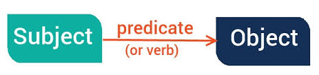
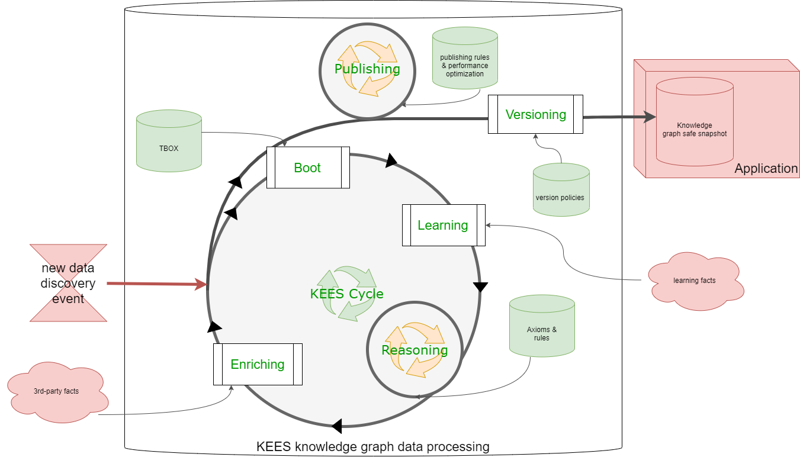

Describing knowledge with KEES (Knowledge Exchange Engine Specifications and Services)
==================================================================

> *In order to let computers to work for us, they must understand data: not just the grammar and the syntax, but the real meaning of things.*

KEES is an architectural design pattern that establishes specific requirements for Semantic Web Applications. Its purpose is to formally describe *domain knowledge* with the goal of making it tradeable and shareable.

Domain knowledge refers to information about a specific subject (e.g., a range of products, commercial offerings, a social network, etc.). Knowledge domains are cumulative, with no defined limits on their scope or size.

With KEES, you can formalize and license all the components necessary to construct a knowledge domain. This includes:
- Methods for collecting accurate data.
- Establishing the context or significance of the data.
- Determining the reliability of the information.
- Deriving new insights from gathered data.
- Guiding the process of using information to address specific queries.

Both machines and humans can leverage this *know-how* to enhance their knowledge. 

For more details, refer to the [KEES presentation slides](https://docs.google.com/presentation/d/1mv9XO0Q9QFxSphWzT_68Q4aXd9sgqWoY7njomH8eaPQ/pub?start=false&loop=false&delayms=5000)."

## Definitions
KEES is mainly a matter of definitions. A lot of concepts used by KEES refer to the well-known [Semantic Web Standards](https://www.w3.org/standards/semanticweb/) published by the World Wide Web Consortium ([W3C](https://w3.org/)).

### Architecture and application
“Application” and  “architecture” terms refer to vague concepts that need further clarification in the KEES context.

The first problem with defining the architecture of an application is that there is no clear definition of what an application is. Our opinion is that applications are a social construction, i.e.:
- a block of code that is seen by developers as a single product;
- a group of features that is made available to the customer;
- a set of functional requirements, with the related cost.

All very different - but all valid - points of view, which make the definition very broad.

People in the IT world have long argued about a precise definition of architecture. For some, it’s something like organizing and planning a system or how higher-level components tie together. Probably the definition that comes closest to capturing the full meaning of the term is the following:

> An architecture is the shared understanding that developers have about the design of the system.

A second common style of definition for architecture is that it is

> The design decisions that must be made at the beginning of a project

in short,

> Architecture is about the important things. Whatever they are.

At first glance, this seems like a trivial statement, but it actually brings a lot of richness: the heart of thinking architecturally about software is deciding what’s important, (i.e., what’s architectural), and spending energy maintaining those elements in good condition. For a developer to become an architect, he must be able to recognize which elements are important, recognizing which ones can cause serious problems if they are not properly controlled.
Important decisions in software development vary depending on the scale of context we are thinking about. A common scale is that of an application, hence “application architecture”.

### Data
*Data*, as per KEES, encompasses any *literal* like words, numbers, or generally, any sequence of symbols. For instance, strings such as `xyz`, `123`, `33.22`, or `http://LinkedData.Center` exemplify *data*. Typically, data is linked with a data type that defines constraints on the sequence of symbols composing the data. For instance, the number `123`, the float `33.22`, or the URI `http://LinkedData.Center` each possess their respective data types, which specify rules regarding the permissible symbols sequence. Importantly, the data type does not inherently convey the meaning of the data itself.

### Information
*Information*, as defined in KEES (also known as **facts**), is characterized as *data with meaning*. This meaning can either be inferred from the context where the data is situated or explicitly defined. KEES adopts the [RDF] standard to delineate information through a triplet of three elements, forming an RDF statement, commonly referred to as a _triple_. This triple comprises a _subject_, a _predicate_, and an _object_. Indeed, a triple can be visualized and represented as an [undirected labeled graph](https://mathinsight.org/definition/undirected_graph), and it can be stored within a **Graph Store**. This store serves as a repository for organizing and maintaining collections of these graph-based representations, allowing efficient storage and retrieval of triples.

### Knowledge
KEES defines *knowledge* as a graph of linked information (i.e. linked data). This graph is possible because, in RDF, any URI can be both the object of a triple and the subject of another one or even the predicate for another.

### Knowledge Graph
In KEES, a *Knowledge Graph* is characterized as a *Graph Store with a purpose*. It represents a collection of interconnected information (i.e. *Linked Data*) organized in a graph-like structure that's designed specifically to be queried, providing answers to specific questions within its domain of related information.

From a theoretical perspective, a knowledge graph comprises information (facts), a formal logic system for knowledge representation, incorporates the [Open-world assumption], and employs an inference engine to demonstrate theorems.

In a knowledge graph, information is partitioned into two datasets: *TBOX* and *ABOX*. *ABOX statements* delineate facts, while *TBOX statements* define the terms used to qualify the meaning of those facts. If you're familiar with the object-oriented paradigm, TBOX statements can be likened to associations with classes, whereas ABOX statements are linked to individual class instances.

*TBOX statements* are typically more enduring within a knowledge graph and are often organized into *ontologies*, describing specific knowledge domains such as business entities, people, goods, friendships, offerings, geocoding, and more. These statements are expressed using an ontology language that offers a formal semantic, like the [W3C OWL](https://www.w3.org/OWL/).

_ABOX statements_, on the other hand, are related to instances of classes defined by TBOX statements. They possess a much more dynamic nature and are populated from datasets available on the web or through reasoning processes.

Theorems within a knowledge graph can manifest as *rules* or *axioms*. A *rule* signifies a generalized inference that establishes a logical correlation between propositions. Conversely, an *axiom* embodies a rule accomplished through entailment that is inferred by the semantics of existing factual information. Axioms and rules can implement deductive and abductive reasoning.

> KEES assumes that knowledge graph is implemented by a [SPARQL service ](https://www.w3.org/TR/sparql11-service-description) supporting the [SPARQL protocol](https://www.w3.org/TR/sparql11-protocol/)

For instance, an axiom could be articulated using OWL (Web Ontology Language) and demonstrated through an OWL reasoner. Alternatively, a rule could be formulated using SPARQL QUERY CONSTRUCT and materialized with SPARQL UPDATE operations.

### Language Profile
The *Language Profile* (also referred to as  semantic *Application Profile*) forms the section of the TBOX comprising all terms recognized by rules and employed to comprehend and respond to inquiries. This profile defines the scope and vocabulary utilized within a *Semantic Web Application*, outlining the terms essential for understanding and generating responses within its semantic framework.

### Linked Data Lake
The internet is full of open data resources. Unfortunately, these resources very often have no SLA. So, when a business requires high data availability, it is best practice to mirror such resources in a data lake. During this download, some ETL processes may occur: for example, transforming raw data into Linked Data according to a defined language profile, adding provenance metadata, ACL, etc.

KEES does not concern the implementation of a Linked Data Lake, but this concept is very useful in any real-world application that uses Semantic Web Technologies.

### Reasonings Classification
In KEES , there are two types of reasoning:
- Deductive reasoning: A logical process in which conclusions are drawn from premises or general principles. Deductive reasoning involves computing axioms to generate new facts from existing ones through theorem demonstration based on the semantic properties of the Language Profile.
- Abductive reasoning: A form of reasoning where the best explanation or hypothesis for a set of observations or phenomena is inferred. Abductive reasoning is achieved through rule computation.

Note that in semiotics there is a third reasoning type: the _Inductive reasoning_ that involves making generalizations based on specific observations or patterns. KEES does not jet able to support _Inductive reasoning_.

### Facts Classification
It is common practice to classify data into categories that aid in distinguishing the sources and ownership of the data, as well as the context in which it is collected and used:

- **Axioms**:  information that is considered self-evident or universally accepted as true without requiring proof or validation
- **First-party data**: Information collected directly from individuals or users by the entity that owns the data, typically through interactions with their own website, app, or services.
- **Second-party data**: Data that is obtained directly from another organization, often through a mutually beneficial partnership or collaboration, where the data is shared directly between the two parties involved. In KEES second-party data ar use to classify deductions derived by semantic rules derived only by first-party data. 
- **Third-party data**: Data collected or obtained from external sources or entities that are not directly affiliated with the organization using the data. This data is often purchased or obtained from data brokers, aggregators, or other external sources.
- **Inferences**: information resulting from a [materialization](https://www.oxfordsemantic.tech/glossary/materialisation) of some reasoning about existing data

### Trust
**Trust** holds significant importance in KEES due to the [Open-world assumption] and the inherent nature of [RDF], which permits the amalgamation of diverse information, even when it might be incoherent or falsified.

In the context of KEES, *trust* serves as metadata linked to each RDF statement, ranging in value from 0 (indicating no trust) to 1 (indicating complete trust). Notably, this concept of *trust* extends to both ABOX and TBOX statements within the knowledge graph.

Moreover, the trust assigned to an inferred fact is intricately tied to the trust levels associated with all the involved facts and rules contributing to its derivation. Therefore, the trustworthiness of an inferred fact is contingent upon the collective trust levels of the underlying information and the processes involved in its generation within the knowledge graph.

The trust value of 0 or 1 signifies certainty in a fact. This principle extends to TBOX statements as well.

Note that the trust of an inferred fact MUST be less or equal to the minimum trust of the involved statements.

Inferred facts can be derived by the following reasoning type:
- **deductions**: when ABOX and TBOX facts are equally trusted
- **abdutions**: when TBOX facts are more trusted than ABOX facts 
- **inductions**: when ABOX facts are more trusted than TBOX facts 

> **An example**
> 
> For instance, suppose that an axiom in your knowledge graph TBOX states that a property ":hasMom" has a cardinality of 1 (i.e. every person has just one "mom"), your knowledge graph could also contain two different facts (:jack :hasMom :Mary) and (:jack :hasMom :Giulia), perhaps extracted from different data sources. In order to decide who is Jack's mom, you need trust in your information. 
> 
> If you are sure about the veracity of all data in the knowledge graph, you can deduct that: Mary and  Giulia are two names for the same person. If you are not so sure, you have two possibilities: deduct that the one data source is wrong, so you have to choose the most trusted statement concerning some criteria (even casually if both statements have the same trust rank) or change the axiom in TBOX, allowing a person to have more than one mom. In any case, you need to get an idea about _your_ trust in each statement, both in ABOX and in TBOX,  in the knowledge graph. At least you want to know the **provenance** and all metadata of all information in your knowledge graph because the trust in a single data often derives from the trust of its source or in the creator of the data source.
> 
> So if: 
> - fact 1: `:jack :hasMom :Mary`
> - fact 2: `:jack :hasMom :Giulia`
> - axiom : `?restriction owl:qualifiedCardinality=1; owl:onProperty :hasMom`
>
> The trust helps to solve potential conflict according to this table:
> 
> | trust in fact 1 | trust in fact 2 | trust in axiom | derived facts                                | derived fact trust | reasoning type |
> |-----------------|-----------------|----------------|----------------------------------------------|--------------------|----------------|
> | k <= 1          | k <= 1          | k <= 1         | new fact (:Mary owl:sameAs :Giulia)          | k                  | deduction      |
> | x < 1           | y > x           | y<=k<=1        | fact1 wasInvalidatedBy (axiom + fact 2)      | <=y                | abduction      |
> | x < 1           | y < x           | x<=k<=1        | fact2  wasInvalidatedBy (axiom + fact 1)     | <=x                | abduction      |
> | k               | k               | z<=k<=1        | axiom wasInvalidatedBy ( fact 1 + fact 2)    | <=z                | induction      |
> | j < z           | j < z           | z<=1           | fact 1 and fact 2 wasInvalidatedBy axiom     |  z                  | free will      |
> 
> Note that the last row in the table is a just subjective illogic paranoic response, you could also decide to:
> - invalidate the axiom (i.e. take the risk of fake data)
> - randomly invalidate one of the conflicting facts (i.e, take the risk of wrong rule )
> - derive that  :jack is not an human and add a restriction on :hasMom property domain ( creative thinking )
> - ...
> Resolving the trust conflict it depends from your risk appetite and from your free will.

### KEES activities
The creation of knowledge requires the execution of certain activities. KEES distinguishes between:
- **Booting Activities**: which initialize an empty knowledge graph with the language profile.
- **Ingestion Activities**: which ingest facts and compute axioms. Ingestion activity are further classified in:
    - **1st-party data learning**
    - **2st-party data learning**
    - **3st-party data learning**
- **Reasoning Activities**: which infer facts.  Reasoning  activities are further classified in:
    - **Deductions** 
    - **Abductions** 
- **Enriching Activities**: which discover and inject new facts by leveraging existing facts, deductions, and abductions.
- **Publishing Activities**: which map the language profile into other ontologies (typically ontologies recognized by applications).

The life cycle of a KEES activity is based on three states:
- *pending*: when an activity is defined but not yet started
- *started*: when an activity is started but not finished
- *ended*: when an activity finished (with or without errors)

  

### KEES knowledge graph state
Taking into account the KEES activities it is possible to define the following states for a knowledge graph:
- *created* this is the initial state of a any existing booted knowledge graph;
- *stable* this is a state where there are no pending or running activities.

More specific states may be defined, for example:
- *ingested*: when all ingestion activities are ended
- *reasoned*: when all reasoning activities are ended
- *enriched*: when all enriching activities are ended
- *published*: when all publishing activities are ended
- etc,etc.

### KEES Cycle
The generation of a knowledge graph involves a sequence of KEES activities organized into phases known as _KEES windows_, forming a workflow called the **KEES cycle**.

The KEES Cycle begins with an empty knowledge graph and provided facts, culminating in a fully populated knowledge base ready for application use. The KEES cycle windows are:
1. **Boot Window** (Startup Phase):  triggers KEES data processing upon specific events indicating new information availability.
2. **Learning Window** (Population): Populates the knowledge graph with known facts, often extracted from the linked data lake. It computes Axioms
3. **Reasoning Window**(Inference): Produces inferences about facts within the knowledge graph, utilizing specific reasoning rules. Reasoning could need to be recomputed on data changes.
4. **Enriching Window** (Fact Enhancement):  discover new third-party facts, enriching the existing data.
5. **Publishing Window** (Optimization and Publication): Involves data cleansing, semantic conflicts resolution, versioning, and mapping to application ontologies.

Note that the step 4 may produce new facts and trigger a new boot of the knowledge graph, this is an interactive process that concludes only when no new data or inferences are discovered.

### KEES Cycle Convergence
The *KEES Cycle Convergence* (or just *convergence*) is defined as the interactive process that, starting from initial facts, executes the KEES cycle until the knowledge graph reaches a *stable* state. The duration between the detection of new data and the reaching of a stable state is termed *convergence time*. It's important to note that the *convergence time* is always greater than zero; this means that the entire KEES cycle can be conceptualized as a big ETL (Extract, Transform, Load) process that produces an eventually consistent mirror of all the ingested data.

### KEES Agent
The term *KEES Agent* refers to a processor capable of understanding the *KEES language profile* . One or more KEES agents may be involved in the execution of a KEES cycle

There are seven types of KEES agents:
- _Orchestrators_: processors that directly support all the activities required to complete a KEES cycle, Could be orchestrator of other KEES agent
- _Autonomous agents_: processors that directly provide Linked Data in a language profile transforming raw data or mapping different ontologies. They do not interface the Knowledge graph, but often are used to feed a Linked Data Lake.
- _loaders_: processors that loads linked data into a Graph Store. They access the Knowledge graph in write only.
- _Publisher_: processors that access the Knowledge graph in read only organizing queries and producing data according different ontologies outside the knowledge graph
- _Learning Agents_: ETL processors that acts both as *fact providers* and *loaders*.
- _Reasoners_: processors that operate within the same knowledge graphs, focusing on applying inference rules while reading and writing data. They access the Knowledge graph in read/write.
- _Enrichers_: special *fact providers* that enhance existing facts by discovering and integrating third-party data as linked data. They access the knowlege graph in read only.

## KEES implementations
Here is a [working draft for a KEES implementation proposal](v1/implementation.md).
LinkedData.Center [SDaaS product](https://linkeddata.center/sdaas) is a commercial implementation of this specifications (also available with  Open Source license)

## Contributing to this site
A great way to contribute to the site is to create an [issue](https://github.com/linkeddatacenter/kees/issues) on GitHub when you encounter a problem or something. We always appreciate it. You can also edit the code by yourself and create a pull request.

## License
KEES is an ongoing research project by [LinkedData.Center]. It is released as open-source and can be used free of charge for non-commercial and private purposes. See our license page for details.

[LinkedData.Center]: https://LinkedData.Center
[RDF]: https://www.w3.org/TR/rdf11-primer/
[Open-world assumption]: https://en.wikipedia.org/w/index.php?title=Open-world_assumption&oldid=871019791
