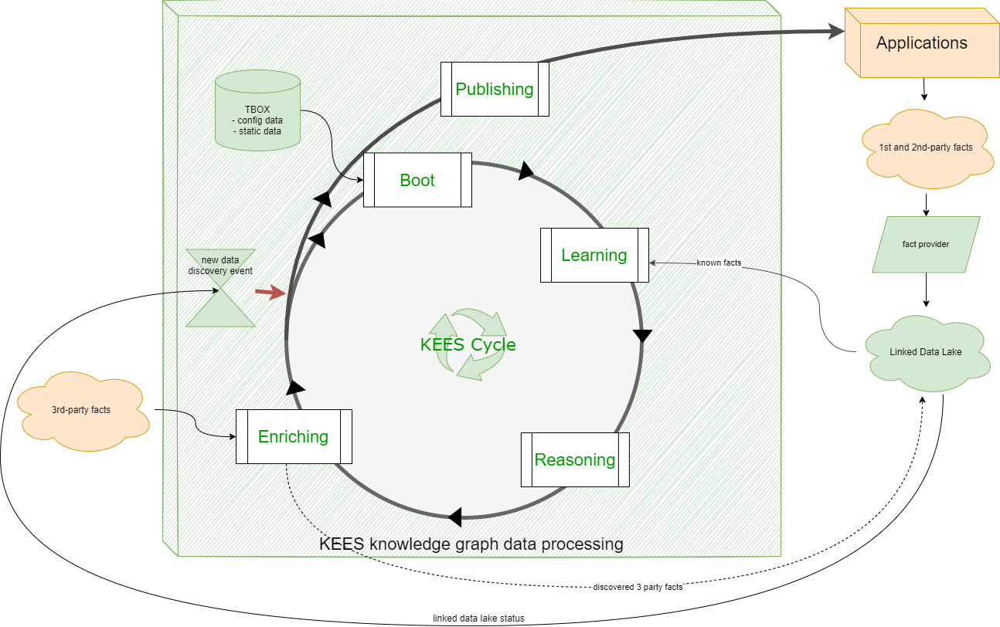

Describing knowledge with KEES (Knowledge Exchange Engine Specifications and Services)
==================================================================

> *In order to let computers to work for us, they must understand data: not just the grammar and the syntax, but the real meaning of things.*

KEES introduces specific requirements for Semantic Web Applications to formally describe *domain knowledge* with the objective of enabling its tradeability and shareability.

Domain knowledge refers to information about a specific subject (e.g., a range of products, commercial offerings, a social network, etc.). Knowledge domains are cumulative, with no defined limits on their scope or size.

With KEES, you can formalize and license all the components necessary to construct a knowledge domain. This includes:

- Methods for collecting accurate data.
- Establishing the context or significance of the data.
- Determining the reliability of the information.
- Deriving new insights from gathered data.
- Guiding the process of using information to address specific queries.

Both machines and humans can leverage this *know-how* to enhance their knowledge. 

For more details, refer to the [KEES presentation slides](https://docs.google.com/presentation/d/1mv9XO0Q9QFxSphWzT_68Q4aXd9sgqWoY7njomH8eaPQ/pub?start=false&loop=false&delayms=5000)."

## Definitions
A lot of concepts used by KEES refer to the well-known [Semantic Web Standards](https://www.w3.org/standards/semanticweb/) published by the World Wide Web Consortium ([W3C](https://w3.org/)).

**Data**, as per KEES, encompasses any *literal* like words, numbers, or generally, any sequence of symbols. For instance, strings such as `xyz`, `123`, `33.22`, or `http://LinkedData.Center` exemplify *data*. Typically, data is linked with a data type that defines constraints on the sequence of symbols composing the data. For instance, the number `123`, the float `33.22`, or the URI `http://LinkedData.Center` each possess their respective data types, which specify rules regarding the permissible symbols sequence. Importantly, the data type does not inherently convey the meaning of the data itself.

**Information**, as defined in KEES (also known as **facts**), is characterized as *data with meaning*. This meaning can either be inferred from the context where the data is situated or explicitly defined. KEES adopts the [RDF] standard to delineate information through a triplet of three elements, forming an RDF statement, commonly referred to as a _triple_. This triple comprises a _subject_, a _predicate_, and an _object_. Indeed, a triple can be visualized and represented as an [undirected labeled graph](https://mathinsight.org/definition/undirected_graph), and it can be stored within a **Graph Store**. This store serves as a repository for organizing and maintaining collections of these graph-based representations, allowing efficient storage and retrieval of triples.

KEES defines **knowledge** as a graph of linked information (i.e. linked data). This graph is possible because, in RDF, any URI can be both the object of a triple and the subject of another one or even the predicate for another.

In KEES, a **Knowledge Graph** is characterized as a *Graph Store with a purpose*. It represents a collection of interconnected information (i.e. *Linked Data*) organized in a graph-like structure that's designed specifically to be queried, providing answers to specific questions within its domain of related information.

From a theoretical perspective, a knowledge graph comprises information (facts), a formal logic system for knowledge representation, incorporates the [Open-world assumption], and employs an inference engine to demonstrate theorems.

In a knowledge graph, information is categorized into two sets: *TBox* and *ABox*. *ABox statements* delineate facts, while *TBox statements* define the terms used to qualify the meaning of those facts. If you're familiar with the object-oriented paradigm, TBox statements can be likened to associations with classes, whereas ABox statements are linked to individual class instances.

*TBox statements* are typically more enduring within a knowledge graph and are often organized into *ontologies*, describing specific knowledge domains such as business entities, people, goods, friendships, offerings, geocoding, and more. These statements are expressed using an ontology language that offers a formal semantic, like the [W3C OWL](https://www.w3.org/OWL/).

_ABox statements_, on the other hand, are related to instances of classes defined by TBox statements. They possess a much more dynamic nature and are populated from datasets available on the web or through reasoning processes.

Theorems within a knowledge graph can manifest as *rules* or *axioms*. A *rule* signifies a generalized inference that establishes a logical correlation between propositions. Conversely, an *axiom* embodies a rule accomplished through entailment that is inferred by the semantics of existing factual information. 

> KEES assumes that knowledge graph is implemented by a [SPARQL service ](https://www.w3.org/TR/sparql11-service-description) supporting the [SPARQL protocol](https://www.w3.org/TR/sparql11-protocol/)

For instance, an axiom could be articulated using OWL (Web Ontology Language) and demonstrated through an OWL reasoner. Alternatively, a rule could be formulated using SPARQL QUERY CONSTRUCT and materialized with SPARQL UPDATE operations.

The **Language Profile** (also referred to as the **Application Profile**) forms the section of the TBOX comprising all terms recognized by rules and employed to comprehend and respond to inquiries. This profile defines the scope and vocabulary utilized within a *Semantic Web Application*, outlining the terms essential for understanding and generating responses within its semantic framework.

The **KEES Language Profile** is the set of all terms and rules that a KEES-compliant application should understand.

A **KEES Agent** describes a processor that understands the *KEES language profile* and it is compliant with the KEES protocols.

**Trust** holds significant importance in KEES due to the [Open-world assumption] and the inherent nature of [RDF], which permits the amalgamation of diverse information, even when it might be incoherent or falsified.

In the context of KEES, **trust** serves as metadata linked to each RDF statement, ranging in value from 0 (indicating no trust) to 1 (indicating complete trust). Notably, this concept of *trust* extends to both ABOX and TBOX statements within the knowledge graph.

Moreover, the trust assigned to an inferred fact is intricately tied to the trust levels associated with all the involved facts and rules contributing to its derivation. Therefore, the trustworthiness of an inferred fact is contingent upon the collective trust levels of the underlying information and the processes involved in its generation within the knowledge graph.

The trust value of 0 or 1 signifies certainty in a fact. This principle extends to TBOX statements as well.

Note that the trust of an inferred fact MUST be less or equal to the minimum trust of the involved statements.

Inferred facts can be partitioned into:
- Fully trusted  inferred facts (i.e. trust=1) are called **deductions**
- Not fully trusted  inferred facts (i.e. `0 < trust < 1` ) are called **abdutions**

> **An example**
> For instance, suppose that an axiom in your knowledge graph TBOX states that a property ":hasMom" has a cardinality of 1 (i.e. every person has just one "mom"), your knowledge graph could also contain two different facts (:jack :hasMom :Mary) and (:jack :hasMom :Giulia), perhaps extracted from different data sources. In order to decide who is Jack's mom, you need trust in your information. 
> 
> If you are sure about the veracity of all data in the knowledge graph, you can deduct that: Mary and  Giulia are two names for the same person. If you are not so sure, you have two possibilities: deduct that the one data source is wrong, so you have to choose the most trusted statement concerning some criteria (even casually if both statements have the same trust rank) or change the axiom in TBOX, allowing a person to have more than one mom. In any case, you need to get an idea about _your_ trust in each statement, both in ABox and in Tbox,  in the knowledge graph. At least you want to know the **provenance** and all metadata of all information in your knowledge graph because the trust in a single data often derives from the trust of its source or in the creator of the data source.
> 
> So if: 
> - fact 1: `:jack :hasMom :Mary`
> - fact 2: `:jack :hasMom :Giulia`
> - axiom : `cardinality(person:hasMom)=1`

> The trust helps to solve potential conflict according to this table
> 
> | trust in fact 1 | trust in fact 2 | trust in axiom | derived fact             | derived fact trust|
> |-----------------|-----------------|----------------|--------------------------|-------------------|
> | 1               | 1               | 1              | :Mary owl:sameAs :Giulia | 1 (deduction)     |
> | x < 1           | y > x           | 1              | :Giulia :isMomOf :jack   | <x (abduction)    |
> | x < 1           | y < x           | 1              | :Mary :isMomOf :jack     | <y (abduction)    |
> | 1               | 1               | z < 1          | {:Mary :Giulia} :isMomOf :jack | <z (abduction) |
> | k < 1           | k < 1           | k < 1          | :Mary owl:sameAs :Giulia | <k (abduction)    |
> | j < 1           | j < 1           | 1              | N.A.                     | N.A.              |

## KEES system components

A KEES system is composed by:
- a **Knowledge Graph** that persists in the most updated knowledge graph. The Knowledge Graph adopts [RDF] and provides an interface to query the knowledge graph (e.g. a SPARQL service)
- some orchestrated **software components**, that interact with the knowledge graph, ingest new data, reason about existing data and query the knowledge

Example of such components are:

- **legacy connectors** that extract RAW data from legacy systems preparing data for ingestion
- **ingestion agents** that translate RAW data into linked data according to language profile
- **reasoners** that make inferences on ABOX using TBOX or rules
- **APIs** that perform specific queries to the knowledge graph to answer questions

## KEES data processing

A KEES agent performs data ingestion in a knowledge graph through a logical sequence of phases called *windows*:

1. a startup phase (**boot window**)  to initialize an empty knowledge graph 
2. population of the knowledge graph with the learning facts (**learning window**) 
3. inference facts materialization (**reasoning window**) 
4. enrich facts discovery and ingestion (**enriching window**) 
5. a slot for optimization, publishing and semantic conflict resolution (**publishing window**)
6. a time allow the knowledge graph and to answer questions (**teaching window**)

Steps 2, 3 and 4 can be iterated till the system converges in a stable configuration.

The sequence of plan execution is called **KEES workflow** and it is a continuous integration process that starts on a triggered change in learned facts.

## KEES implementations

Here is a [working draft for a KEES implementation proposal](implementation.md)

LinkedData.Center SDaaS product is a commercial early and partial implementation of KEES specifications (also available the Open Source community version)

## Contributing to this site

A great way to contribute to the site is to create an [issue](https://github.com/linkeddatacenter/kees/issues) on GitHub when you encounter a problem or something. We always appreciate it. You can also edit the code by yourself and create a pull request.

All stuff here in the Creative Common (unless otherwise noted).

[RDF]: https://www.w3.org/TR/rdf11-primer/
[Open-world assumption]: https://en.wikipedia.org/w/index.php?title=Open-world_assumption&oldid=871019791
