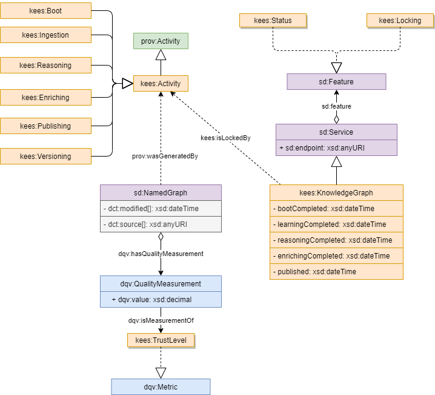

Implementing KEES 
=======================================

This working draft collects a proposal for a concrete KEES implementation.

## The KEES Language profile

The KEES Language Profile reuses some terms from existing, well known vocabularies:

| Prefix   | URL                                              |
|----------|--------------------------------------------------|
| dct      | http://purl.org/dc/terms/                        |
| dqv      | http://www.w3.org/ns/dqv#                        |
| prov     | http://www.w3.org/ns/prov#                       |
| sd       | http://www.w3.org/ns/sparql-service-description# |
| void     | http://rdfs.org/ns/void#                         |
| xsd      | http://www.w3.org/2001/XMLSchema#                |

The Dublin Core terms, accessible at [Dublin Core Terms](https://www.dublincore.org/specifications/dublin-core/dcmi-terms/), serve as annotations for named graphs. Specifically, properties like `dct:created`, `dct:modified` and `dct:source` are expected to be acknowledged in such instances.

As per the SPARQL service description vocabulary outlined in [SPARQL Service Description](https://www.w3.org/TR/sparql11-service-description/), KEES agent are expected to acknowledge and utilize properties such as `sd:endpoint`, `sd:feature`, `sd:NamedGraph`, and `sd:name`.

Knowledg graph building activities should be traced using [PROV ontology](https://www.w3.org/TR/prov-overview/). KEES agents should recognize at least on `prov:wasGeneratedBy` in named graphs instances and  `prov:invalidatedBy` in knowledge graph

The attainment of trustability is facilitated by associating quality observations with the ingested graph. To support this functionality, the KEES language profile repurposes terms from the [Data on the Web Best Practices: Data Quality Vocabulary](https://www.w3.org/TR/vocab-dqv/) such as `dqv:hasQualityAnnotation`, `dqv:value`, and `dqv:isMeasurementOf`."

When utilized in named graph metadata, a KEES agent is expected to acknowledge the term `void:dataDump` from the [VoID Vocabulary](https://www.w3.org/TR/void/#void-file).

The KEES vocabulary encompasses a limited set of terms defined within the `http://linkeddata.center/kees/v1#` namespace, commonly referenced using the prefix *kees:*.  The whole KEES vocabulary is expressed with OWL RDF and available in [kees.rdf file](kees.rdf). A KEES agent should recognize all KEES vocabulary.

The following picture summarizes the main elements of the KEES language profile. 




## RDF Store requirement
To Know the **provenance** of each statement, it is of paramount importance to get an idea about data quality. For this reason, KEES requires that all statements must have a fourth element that links to a data source. This means that, for practical concerns, the KEES knowledge base is a collection of quads, i.e. a triple plus a link to metadata.

Any RDF Store that provides with a SPARQL endpoint compliant with this service description is potentially compliant with KEES. 

```turtle
[] a sd:Service ;
    sd:supportedLanguage sd:SPARQL11Query, sd:SPARQL11Update;
    sd:resultFormat <http://www.w3.org/ns/formats/RDF_XML>, <http://www.w3.org/ns/formats/Turtle> ;
    sd:feature sd:UnionDefaultGraph .
```


## KEES protocol and axioms
KEES application and agents **SHOULD** follow the rules in this chapter


### Knowledge graph are additive
A KEES agent never delete information from knowledge graph. Temporary graph are allowed.


### Knowledge Graph metadata 
A KEES application should manage the following knowledge graph metadata:

- `dct:created` with cardinality exactly 1, range xds:dateTime
- `kees:ingested` with cardinality <= 1, range xds:dateTime
- `kees:reasoned` with cardinality <= 1, range xds:dateTime
- `kees:enriched` with cardinality <= 1, range xds:dateTime
- `kees:published` with cardinality <= 1, range xds:dateTime
- `kees:versioned` with cardinality <= 1, range xds:dateTime
- `prov:wasInvalidatedBy` with cardinality >= 0, range prov:Activity
- `kees:wasLockedBy` with cardinality >= 0,

The boot process, should link:
- `sd:feature kees:Status` if the application must supports KEES window states protocol
- `sd:feature kees:Locking` if agents must supports KEES locking protocol


### Request a knowledge graph reboot
Sometime you need to signal that data in knowledge base needs (or will need) to be update. In this case you **SHOULD** use:

```sparql
INSERT { ?service prov:invalidatedBy [ a prov:Agent ] }
WHERE { ?service a kees:KnowledgeGraph }
```

To test if you should reboot the knowledge base:
```sparql
ASK { ?service a kees:KnowledgeGraph; prov:invalidatedBy [] }
```

The kees agent implementations can add restrictions on agents allowed to ask Knowledge Graph invalidation.


### Booting protocol
A when requested to reboot, a KEES application should erase the entire graph store and produce a default graph equivalent to the following rule:

```sparql
    DROP SILENT ALL;
    INSERT DATA {
        [] a kees:KnowledgeGraph ;
            sd:endpoint <HERE SPARQL ENDPOINT> ;
            sd:feature kees:Status, kees:Locking ;
            dct:created "HERE THE CREATION DATE"^^xsd:dateTime .
    }
```


### Knowledge Graph status 
During knowledge base building and updates, KEES agents should declare the completion of a KEES cycle window
For instance to declare that a RDF Store is ready to be safely queried, execute following SPARQL UPDATE statement:

```sparql
INSERT { ?service kees:published ?now }
WHERE { 
    ?service a kees:KnowledgeGraph BIND( NOW() AS ?now) 
    FILTER NOT EXISTS { ?service kees:published [] }
}
```

To check if a RDF Store is *safe*, use: 

```sparql
ASK { ?service kees:published|kees:versioned [] }`
```

To get the current knowledge graph status:

```sparql
SELECT ?status
WHERE{ 
    VALUES ?status {
        dct:created
        kees:ingested
        kees:reasoned
        kees:enriched
        kees:published
        kees:versioned
    }
    OPTIONAL { ?service a kees:KnowledgeGraph; ?status ?on_date }
} ORDER DESC( ?on_date) LIMIT 1
```

### Named graph metadata
Named graph created by a KEES agent should expose following metadata:
- dct:modified with cardinality > 0, range: xsd:dateTime
- dct:source with cardinality  >= 0, range: owl:Thing
- prov:wasGeneratedBy with cardinality >= 0, range: kees:Activity

To check the creation and last update date of named graphs:

```sparql
SELECT ?graphName (MIN(?updated) as ?created) (MAX(?updated) as ?lastUpdated) WHERE {
    ?g sd:name ?graphName ;
    dct:modified ?updated
} GROUP BY ?graphName
```


### Trust management
Trust is accomplished by annotating a named graph with the property `dqv:hasQualityMeasurement` with cardinality >= 0 , range a measure with `dqv:isMeasurementOf kees:trustLevel` attribute and `dqv:value` in the decimal range 0-1 


### Knowledge base locking
At times, multiple processes may need access to the same knowledge graph, leading to potential locking scenarios. Ideally, agents should utilize the OS standard locking mechanism (e.g., flock). However, if this isn't feasible, a stopgap solution can be employed (though it's not entirely secure):

To establish an exclusive lock on the knowledge graph, consider using this pseudo-code:

```bash

function unlock {
    DELETE  { ?service kees:isLockedBy ?anything }
    WHERE  { ?service  a kees:KnowledgeGraph;  kees:isLockedBy ?anything }
}

function lock {
    local UNIQUE_URI=${1:-"urn:uuid:$(date +%s%N)$(echo $RANDOM)"}
    while : ; do
        INSERT { ?service kees:isLockedBy <$UNIQUE_URI> } 
        WHERE { FILTER ! EXISTS { ?service a kees:KnowledgeGraph; kees:isLockedBy [] } } 
        if  ASK { ?service  a kees:KnowledgeGraph;  kees:isLockedBy <$UNIQUE_URI>}; then
            break
        else
            sleep 10
        fi 
    done
}


LOCKID=$(lock)
trap unlock EXIT  # ensure lock is removed also on script exit
    ... do your jobs
unlock
trap '' EXIT
```

Be sure to delete lock even in case of error or script exit

## Example of a dump of a KEES compliant Knowledge Graph

```turtle
@base <http://www.example/sparql/> .
@prefix dct: <http://purl.org/dc/terms/> .
@prefix rdfs: <http://www.w3.org/2000/01/rdf-schema#> .
@prefix kees: <http://linkeddata.center/kees/v1#> .
@prefix sd: <http://www.w3.org/ns/sparql-service-description#> .
@prefix : <#>


# default graph
{
    [] a kees:KnowledgeGraph ;
        sd:endpoint <> ;
        sd:feature kees:Status, kees:Locking ;
        kees:isLockedBy <urn:kees:kb:isLockedBy> [ a kees:Activity ] ;
        dct:created "2023-12-10T01:00:01Z"^^xsd:dateTime ;
        kees:ingested "2023-12-10T01:01:01Z"^^xsd:dateTime ;
        kees:reasoned "2023-12-10T01:02:01Z"^^xsd:dateTime ;
        kees:enriched "2023-12-10T01:03:01Z"^^xsd:dateTime ;
        kees:published "2023-12-10T01:04:01Z"^^xsd:dateTime .
}


:98dccee27a081f9cd75d15b8af59a3d6 {
    [] a sd:NamedGraph;
        sd:name :98dccee27a081f9cd75d15b8af59a3d61 ;
        dct:modified "2023-12-10T01:01:02Z"^^xsd:dateTime ;
        dct:source  <http:/example.org/resource.ttl> ;
        prov:wasGeneratedBy [ a kees:Ingestion ] ;
        dqv:hasQualityMeasurement [ dqv:value 0.99 ; dqv:isMeasurementOf kees:trustLevel ] .
}


<http:/example.org/.well-known/void> {
    [] a sd:NamedGraph;
        sd:name <http:/example.org/.well-known/void> ;
        dct:modified "2023-12-10T01:02:02Z"^^xsd:dateTime ;
        dct:source  <http:/example.org/void.ttl> ;
        prov:wasGeneratedBy [ a kees:Ingestion ] ;
        dqv:hasQualityMeasurement [ dqv:value 0.75 ; dqv:isMeasurementOf kees:trustLevel ] .

    ## here the example triple exposed by http:/example.org/void.ttl
    <http:/example.org/.well-known/void> a kees:KnowledgeBaseDescription ;
        foaf:primaryTopic  <http:/example.org/dataset1#dataset> .

    <http:/example.org/dataset1#dataset> 
        void:dataDump 
            <http:/example.org/dataset/part1.ttl> ,
            <http:/example.org/dataset/part2.ttl> .
    
    ## ...
}


<http:/example.org/dataset1#dataset> {
    [] a sd:NamedGraph;
        sd:name <http:/example.org/dataset1#dataset>
        dct:modified 
            "2023-12-10T01:04:03Z"^^xsd:dateTime , 
            "2023-12-10T01:05:04Z"^^xsd:dateTime ;
        prov:wasGeneratedBy [ a kees:Ingestion ] ;
        dct:source: 
            <http:/example.org/dataset/part1.ttl> , 
            <http:/example.org/dataset/part2.ttl> .

    # ... here triples merged from all data dumps
}

```